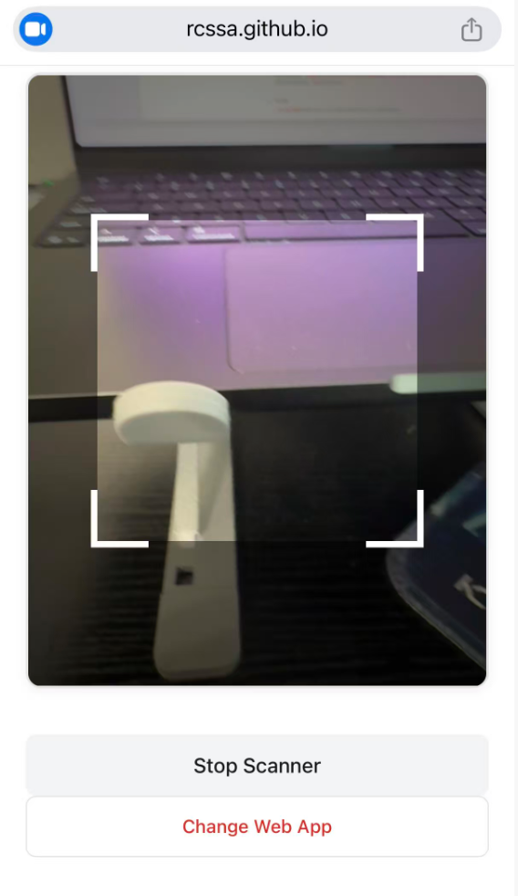

# RCSSA Check-In Webapp

## 1. Overview

A QR-code check-in system for RCSSA events. Staff open the webapp on a phone, scan each attendee's QR code with the camera, and the app looks up the code against a Google Sheet and marks the attendee as checked in — in real time, with no dedicated backend server or database.

## 2. Motivation

Event check-in needs to work with zero setup cost for a student organization: no server to provision, no database to maintain, no ongoing hosting bill. This app is built entirely on tools that are already free and familiar — a Google Sheet as the attendee roster, Google Apps Script as the backend, and GitHub Pages for the frontend — so any RCSSA volunteer with edit access to the Sheet can run a check-in station without needing an engineer on call.

## 3. Quick start

1. Deploy the backend once (see [Env setup](#4-env-setup) below) and copy the resulting Web App URL.
2. Open the live app: **https://rcssa.github.io/Check-in-webapp/**
3. Paste the Web App URL into the **"Enter AppScript Deployment Code"** field and click **Connect**. The app tests the connection, then switches to the camera scanner.
4. Point the camera at an attendee's QR code. The result appears as a full-screen page:
   - ✅ green — checked in successfully
   - ⚠️ yellow — already checked in
   - ❌ red — code not found in the sheet
5. After 4 seconds the app automatically returns to the scanner, ready for the next attendee.
6. To switch to a different event's sheet, click **Change Web App** to go back to step 3.



## 4. Env setup

This is a static site with no build step and no package manager — there's nothing to `npm install`.

**Deploy the backend (one-time, per Google Sheet):**
1. Open the target Google Sheet.
2. Go to **Extensions → Apps Script**.
3. Copy the contents of `apps-script.js` into the script editor.
4. Click **Deploy → New deployment**, choose type **Web app**.
5. Set **Execute as: Me** and **Who has access: Anyone**.
6. Click **Deploy** and copy the generated Web App URL — this is what gets pasted into the frontend's welcome screen.

The Google Sheet must have the ticket code in **column E (5th column)** and a `TRUE`/`FALSE` checked-in flag in **column G (7th column)**, with row 1 as a header row.

## 5. Tech stack

- **Frontend**: Plain HTML/CSS/JavaScript.
- **QR scanning**: [html5-qrcode](https://github.com/mebjas/html5-qrcode) (loaded via CDN, `unpkg.com`), which wraps the browser's camera (`getUserMedia`) and decodes QR codes from the video stream.
- **Backend**: [Google Apps Script](https://developers.google.com/apps-script), deployed as a Web App and bound to a Google Sheet via `SpreadsheetApp.getActiveSpreadsheet()`.
- **Data store**: The Google Sheet itself — no separate database.
- **Hosting**: [GitHub Pages](https://rcssa.github.io/Check-in-webapp/), serving the static files directly from this repo.

## 6. Repo structure

```
.
├── index.html      # Markup for all screens: welcome, scanner, and 3 status pages
├── script.js       # All frontend logic — connecting, scanning, calling the API, UI transitions
├── style.css       # All styling, including status-page colors and animations
└── apps-script.js  # Backend source; pasted into a Google Sheet's Apps Script editor (not run from this repo)
```

## 7. Key API

The only interface between frontend and backend is the Google Apps Script Web App, called entirely over `GET` requests with query parameters (this avoids the CORS preflight that a POST+JSON request would trigger, since Apps Script Web Apps don't handle `OPTIONS`).

**Base URL**: the deployed Web App URL, e.g. `https://script.google.com/macros/s/.../exec`

### `GET ?action=getData`
Returns the full contents of the sheet. Used to validate a Web App URL when the user clicks Connect.
```json
{ "success": true, "message": "Data retrieved", "data": [[...], [...]] }
```

### `GET ?action=checkIn&qrCode=<value>`
Looks up `qrCode` against column E of the sheet and updates column G.
```json
// First scan
{ "success": true, "message": "Check-in Success!", "status": "checked_in", "rowIndex": 2 }

// Repeat scan
{ "success": true, "message": "Already checked in!", "status": "already_checked_in", "rowIndex": 2 }

// No matching row
{ "success": true, "message": "Not registered", "status": "not_registered" }
```

Note that `success` is `true` in all three cases above — it only becomes `false` on a genuine server error. The frontend branches on the inner `status` field, not on `success`.

There is no authentication on this API — anyone with the Web App URL can read the full sheet and write check-in status. The deployment's "Anyone" access setting is what makes the URL itself the de facto access credential.
